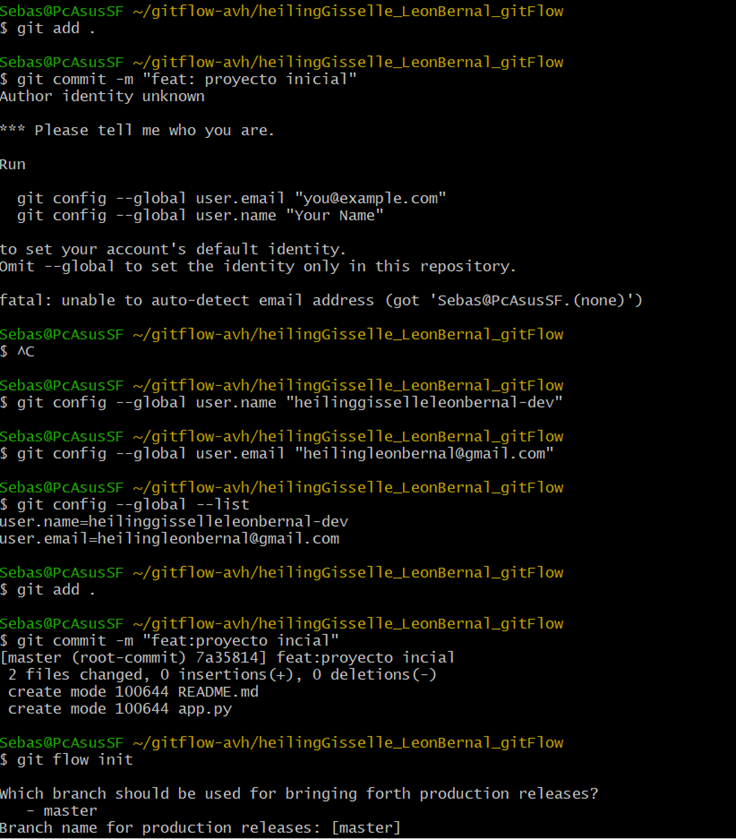
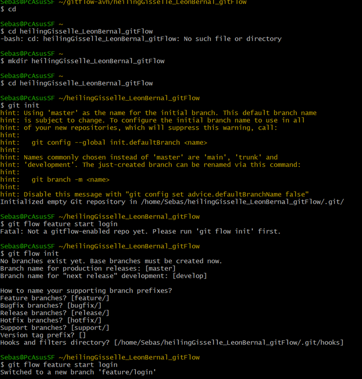
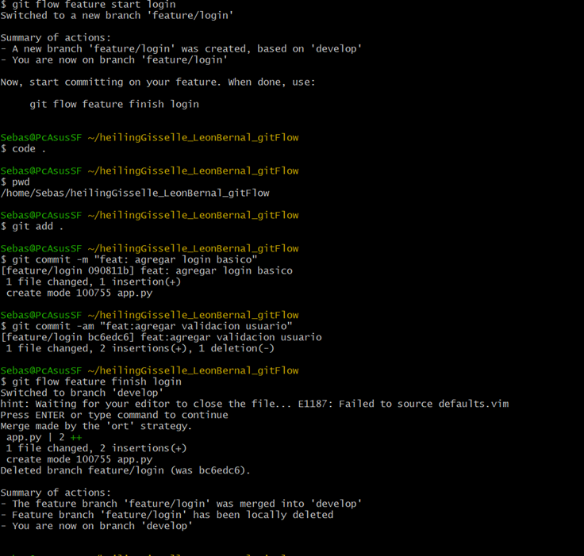
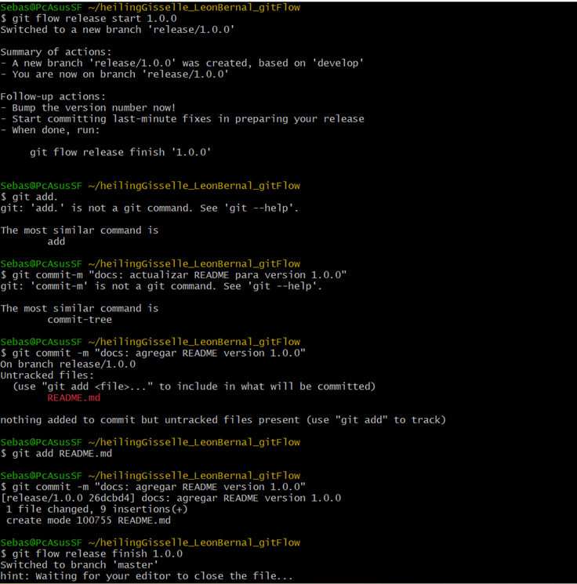
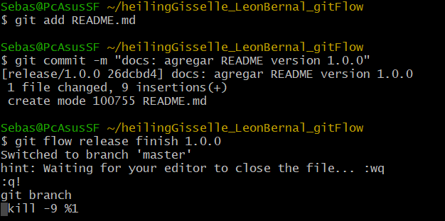
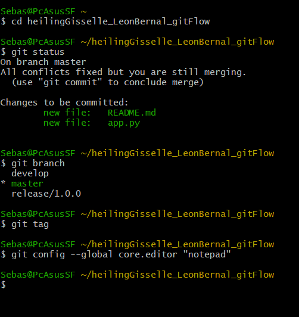
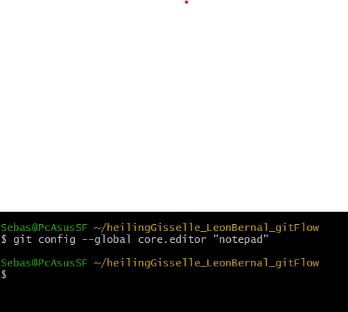

# Documentación del Proceso de Instalación y Uso de Git Flow

## 1. Problema inicial con la configuración de Git

Al comenzar el proyecto, el primer inconveniente se presentó al momento de realizar el primer commit. Git mostró un mensaje indicando que no reconocía la identidad del autor.

El mensaje que apareció fue:

```
Author identity unknown
Please tell me who you are.
fatal: unable to auto-detect email address
```

Esto ocurrió porque no estaban configurados el nombre y el correo electrónico del usuario en Git.

Para verificar la versión instalada se utilizó el siguiente comando:

```
git --version
```

## Problema presentado

Git estaba instalado, pero no tenía configurada la información del usuario, lo que impedía realizar commits correctamente.
Además, inicialmente Git Flow no podía utilizarse hasta que el repositorio estuviera bien configurado.

## Solución

Se configuró la identidad global del usuario con los siguientes comandos:

```
git config --global user.name "heilinggisselleleonbernal-dev"
git config --global user.email "heilingleonbernal@gmail.com"
```

Luego se verificó la configuración con:

```
git config --global --list
```

Después de esto, los commits funcionaron correctamente.

img/usuario-user.png


---

## 2. Creación del repositorio

Inicialmente se intentó ingresar a una carpeta que no existía, por lo que fue necesario crearla manualmente.

Se ejecutaron los siguientes comandos:

```
mkdir heilingGisselle_LeonBernal_gitflow
cd heilingGisselle_LeonBernal_gitflow
```

Luego se inicializó el repositorio con:

```
git init
```

Con esto se creó el repositorio vacío y se generó la carpeta `.git`.

img/creacion-carpeta.png


---

## 3. Inicialización de Git Flow

Después de tener el repositorio configurado correctamente, se procedió a inicializar Git Flow con el siguiente comando:

```
git flow init
```

Durante la configuración se dejaron las opciones por defecto:

* Rama principal: master
* Rama de desarrollo: develop
* Prefijo para features: feature/
* Prefijo para releases: release/
* Prefijo para hotfix: hotfix/

Con esto quedó estructurado el flujo de trabajo del proyecto.

img/gitflow-init.png


---

## 4. Creación de una rama feature

Para desarrollar la funcionalidad de inicio de sesión se creó una nueva rama feature con el comando:

```
git flow feature start login
```

Esto creó la rama `feature/login` basada en `develop`.

Se realizaron modificaciones en el archivo `app.py` y se hicieron los siguientes commits:

```
git add .
git commit -m "feat: agregar login basico"
git commit -am "feat: agregar validacion usuario"
```

Una vez finalizado el desarrollo, se cerró la feature con:

```
git flow feature finish login
```

Este comando realizó automáticamente el merge hacia `develop` y eliminó la rama `feature/login`.

img/feature-login.png


---

## 5. Creación de la rama release

Después de terminar la funcionalidad y tener estable la rama develop, se creó la versión 1.0.0 con el siguiente comando:

```
git flow release start 1.0.0
```

Esto generó la rama:

```
release/1.0.0
```

En esta rama se realizaron ajustes finales, incluyendo la actualización del archivo README.

img/release-start.png


---

## 6. Error al finalizar la release

Al ejecutar el siguiente comando:

```
git flow release finish 1.0.0
```

La terminal mostró el siguiente mensaje:

```
Switched to branch 'master'
hint: Waiting for your editor to close the file...
```

En ese momento la terminal quedó bloqueada y no permitió continuar.

img/error-editor.png


---

## 7. Causa del problema

El problema ocurrió porque Git utiliza por defecto el editor Vim para escribir el mensaje del merge.

Al no cerrarse correctamente el editor, el proceso quedó detenido y la terminal parecía congelada. No se podía continuar hasta cerrar el editor correctamente.

---

## 8. Solución aplicada

### Opción 1: Cerrar la terminal

Se cerró completamente Cygwin y se volvió a abrir.

Luego se verificó el estado del repositorio con:

```
git status
git branch
git tag
```

Se confirmó que:

* La rama master estaba actualizada.
* La rama develop estaba sincronizada.
* El tag 1.0.0 fue creado correctamente.

img/verificacion-final.png


---

### Opción 2: Configurar otro editor

Para evitar que el problema volviera a ocurrir, se configuró un editor diferente con el siguiente comando:

```
git config --global core.editor "code --wait"
```

También se puede usar:

```
git config --global core.editor "notepad"
```

De esta manera, cuando Git solicite escribir un mensaje, se abrirá un editor más sencillo y no Vim.

img/config-editor.png


---

## 9. Resultado final

Después de aplicar todas las soluciones:

* El repositorio quedó correctamente configurado.
* Git Flow se inicializó sin problemas.
* Se creó y finalizó una feature correctamente.
* Se creó y finalizó la release 1.0.0.
* Se generó correctamente el tag 1.0.0.
* Se solucionó el problema del editor.

El flujo de trabajo con Git Flow quedó funcionando correctamente y el proyecto quedó versionado de manera organizada.
